# GitHubAnalytics.jl
[](https://divital-coder.github.io/GithubAnalytics.jl/stable/)
[](https://divital-coder.github.io/GithubAnalytics.jl/dev/)
[](https://codecov.io/gh/divital-coder/GithubAnalytics.jl)

## Overview
GithubAnalytics.jl is a Julia package that provides comprehensive analytics for GitHub repositories and organizations. It fetches data from the GitHub API, processes metrics about repository activity, and generates visualizations and reports to help you understand repository health and contribution patterns.

## Features
- **Repository Analysis**: Analyzes stars, forks, issues, pull requests, and commit history
- **Organization-Wide Insights**: Aggregates metrics across multiple repositories 
- **Contributor Analysis**: Identifies top contributors and contribution patterns
- **Issue Management Metrics**: Tracks resolution rates and time-to-close statistics
- **Powerful Visualizations**: Creates plots for repository activity, language distributions, and more
- **Temporal Analysis**: Analyzes trends in issue resolution time and commit activity
- **Flexible Output**: Generates CSV data files, markdown reports, and visualizations

## Example Visualizations
> 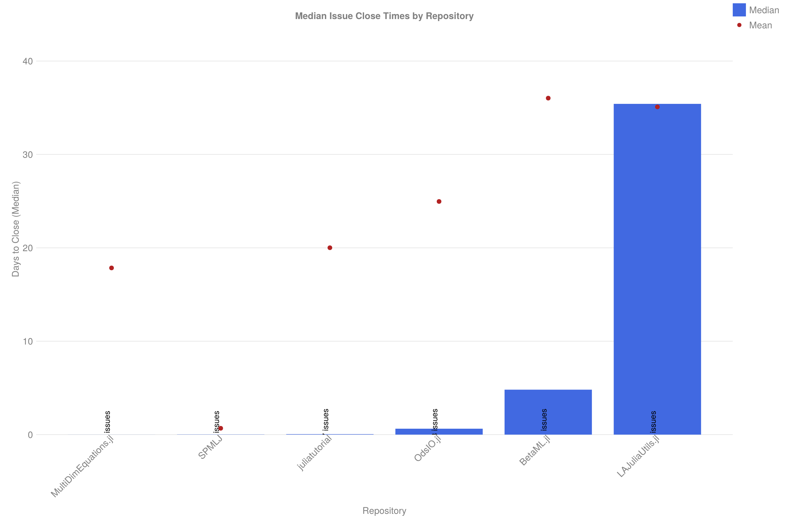
> 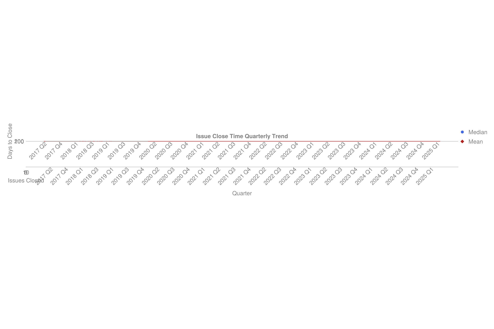
> 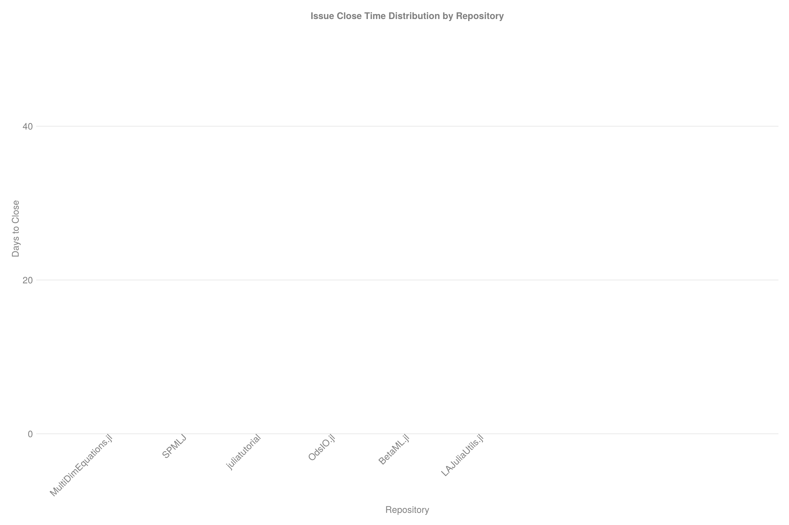
> 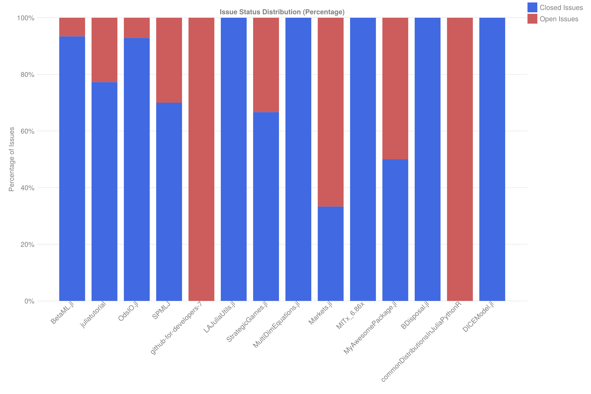
> 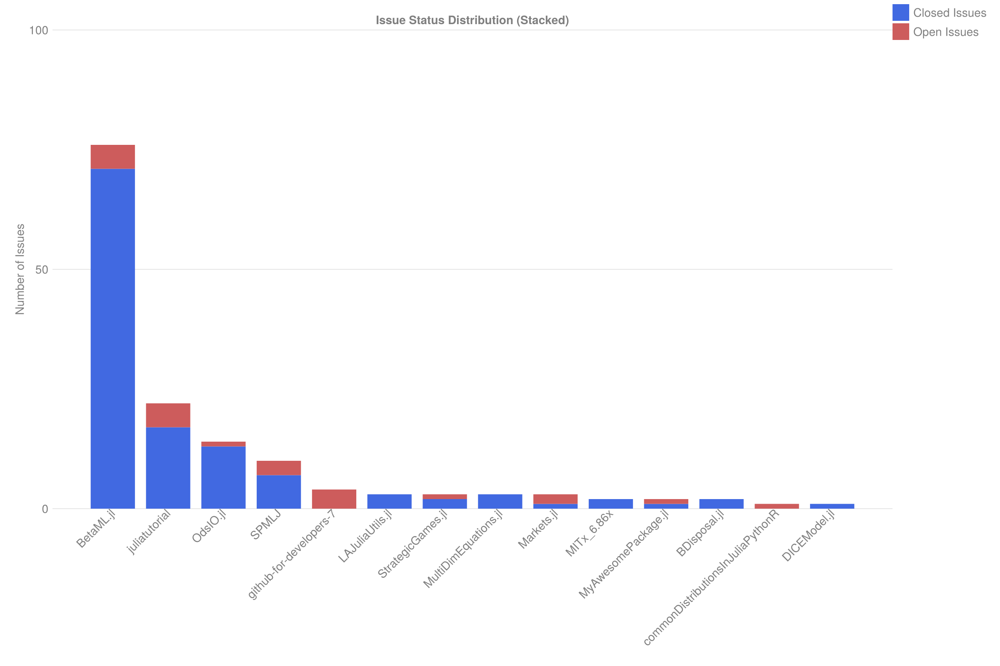
> 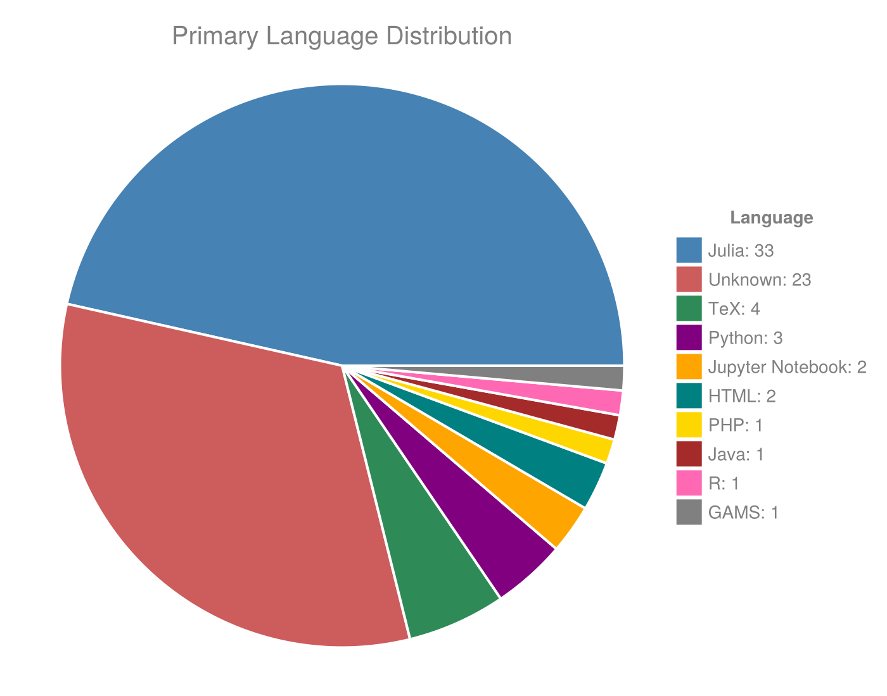
> 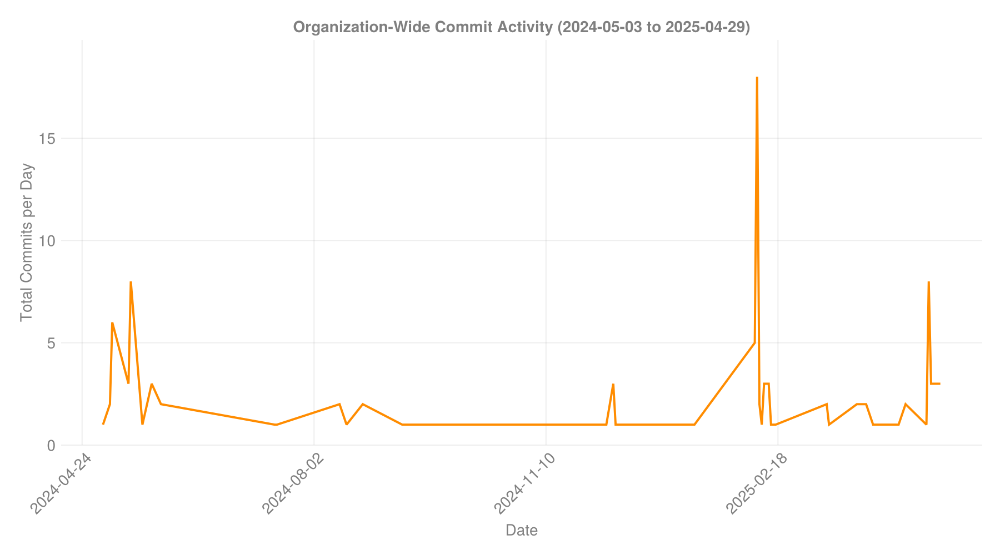
> 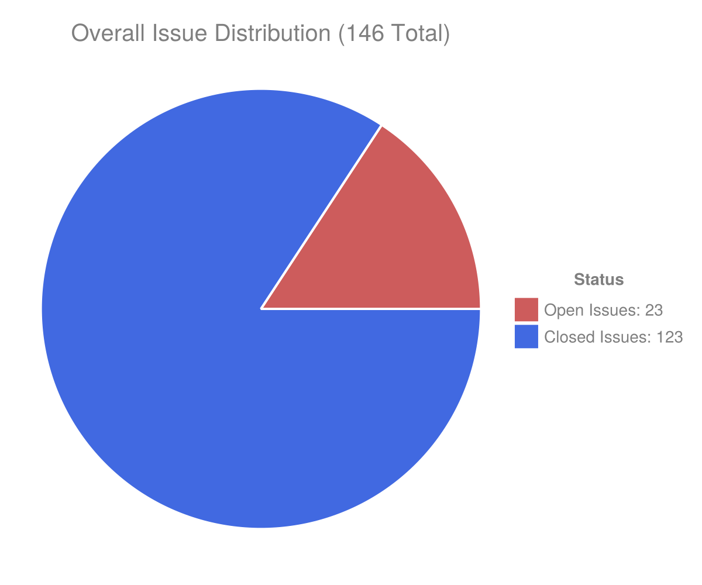
> 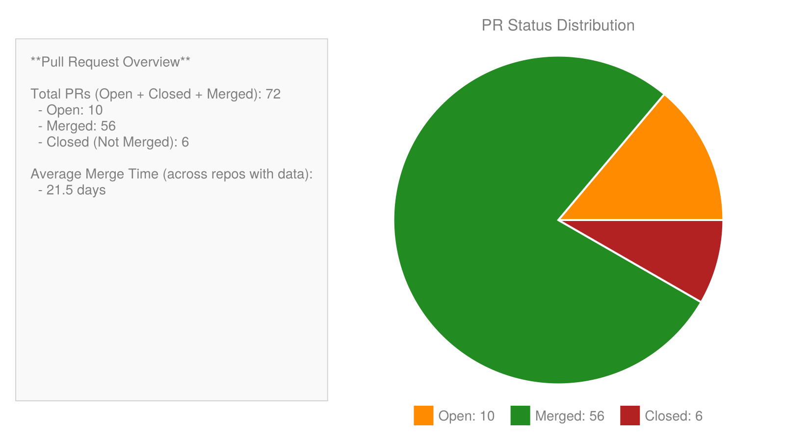
> 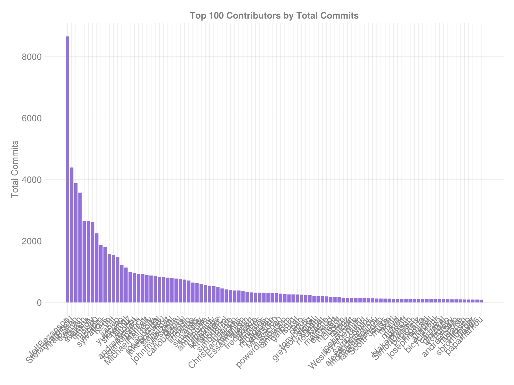
> 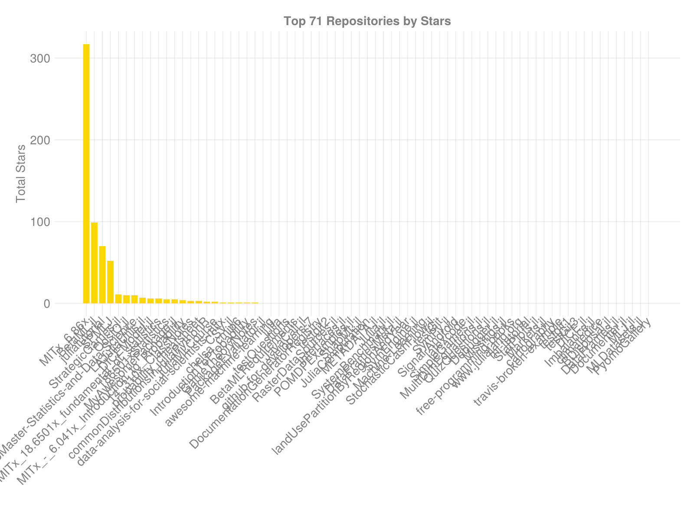

## Installation

```julia
using Pkg
Pkg.develop("https://github.com/JuliaHealth/GitHubAnalytics.jl")
```

## Quick Usage

```julia
using GitHubAnalytics
using Logging

# Ensure you have a GitHub token (needed for API access)
token = ENV["GITHUB_TOKEN"]

# Create configuration
config = AnalyticsConfig(
    targets = ["JuliaLang", "JuliaLang/julia"],  # Analyze org and specific repos
    auth_token = token,
    output_dir = "github_analysis_results",
    log_level = Logging.Info,
    fetch_contributors = true, 
    fetch_commit_history = true,
    fetch_pull_requests = true,
    generate_plots = true,
    generate_csv = true,
    generate_markdown = true
)

# Run analysis
results = run_analysis(config)
```

## Visualizations

GithubAnalytics.jl generates a variety of visualizations to help understand repository activity:

- Repository metrics (stars, forks, commits)
- Issue status distribution
- Issue resolution time analysis
- Commit activity trends
- Contributor summaries
- Language distribution
- Pull request metrics

The issue close time visualizations provide especially valuable insights into repository health, showing both the distribution of close times and how they trend over time.

## License

This package is licensed under [MIT License](LICENSE).
